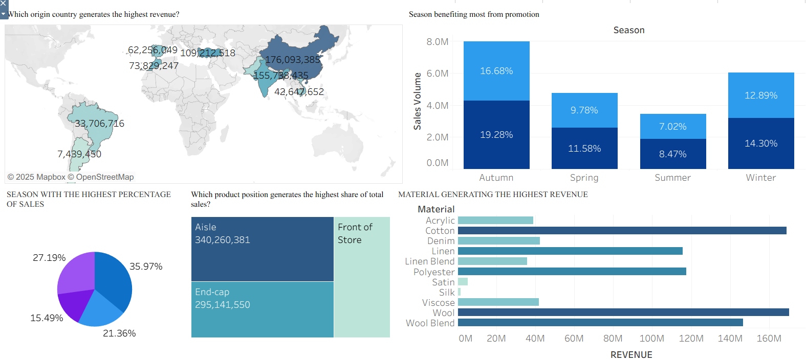
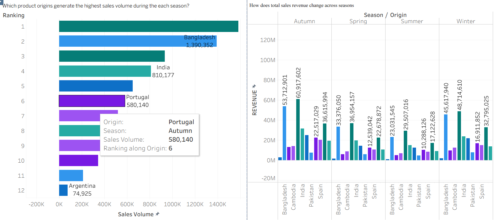

# Hi, I'm Yisa Ajibola Ahmed 👋  
### Data Analyst | Client Insights | Regulatory Analytics | Forecasting | KPI Reporting

I’m a Business & Data Analyst with **~5 years’ combined experience** across **client insights, regulatory data, forecasting, KPI reporting, and dashboards**.  
I turn complex datasets into **clear insights, stories, and recommendations** for stakeholders.

📍 Dublin, Ireland | 📧 yisaajibola101@gmail.com | 🔗 LinkedIn: www.linkedin.com/in/ajibola-yisa-a90a54282

---

## 🔧 Core Skills
- **SQL:** joins, aggregations, validation, reporting extracts  
- **Excel:** Power Query, PivotTables, dashboards, data cleaning, forecasting models  
- **Tableau / Power BI:** KPI dashboards, performance reporting, storytelling  
- **Analytics:** trend analysis, variance (budget vs actual), KPI design, forecasting  
- **Stakeholders:** client reporting, insight writing, presenting findings clearly

---

## 💼 Experience Snapshot
**Data Analyst (Remote/Hybrid) — Corlytics (Dublin) | Jul 2023 – Jun 2025**  
- Cleaned and validated regulatory datasets and supported reporting cycles  
- Built/maintained Tableau dashboards (regulatory trends, themes, risks)  
- Used SQL for weekly/monthly extracts and insight reporting  
- Contributed to client-facing reports and improved data processes

**Senior Data Analyst — Weevil Company (Lagos) | Jan 2021 – Jun 2023**  
- Built automated Excel dashboards and KPI reporting for management  
- Forecasted demand and supported inventory optimisation decisions  
- Delivered profitability/pricing insights for campaigns and launches

**Night Pub & Hotel Manager — Wetherspoon (Swords) | Summer 2025 – Present**  
- Operational reporting, reconciliation, performance tracking, and incident reporting

---

## 📂 Featured Portfolio Projects (GitHub Repos)

### 1) Regulatory Insights Dashboard (Tableau)
**Tools:** Tableau, SQL, Excel  
- Dashboard showing regulatory trends, categories, and risk themes  
- Data cleaning notes + stakeholder summary  
## 📊 Dashboard Overview

Below are key visuals from the interactive Tableau dashboard used in this analysis.

### 🔹 Revenue Drivers, Promotion Impact & Material Analysis

### 🔹 Sales Volume & Revenue by Season and Origin 

### 2) Sales Forecasting + Budget vs Actual (Excel)
**Tools:** Excel (Power Query, Pivot, forecasting)  
- Forecast model + variance analysis  
- Clear insights + recommendations  
# 📈 Sales Forecasting & Budget vs Actual Dashboard (Excel)

## 📌 Project Overview
This project showcases a **sales forecasting and performance analysis dashboard built in Microsoft Excel**.

The dashboard compares **latest year vs prior year sales and profit**, highlights **growth trends**, and supports **budget vs actual analysis** across product categories, customer segments, and regions.

> 📌 *Note: Due to data confidentiality, the original Excel workbook is not shared.  
Screenshots of the final dashboard are provided to demonstrate analytical and reporting capability.*

---

## 🛠 Tools & Skills Demonstrated
- Microsoft Excel
  - Pivot Tables & Pivot Charts
  - KPI dashboards
  - Year-over-Year (YoY) analysis
  - Forecasting and trend analysis
- Business performance reporting
- Executive insight communication

---

## 📊 Dashboard Preview

### 🔹 Forecasting & Performance Dashboard

**Key elements shown:**
- Sales & profit KPIs (Latest Year vs Prior Year)
- Sales and profit growth percentages
- Category-level performance (Furniture, Office Supplies, Technology)
- Customer segments (Consumer, Corporate, Home Office)
- Quarterly sales and price trends
- Regional and state-level sales performance

---

## 📈 Key Insights
- Sales and profit show strong **year-over-year growth**
- Technology and Furniture are major revenue drivers
- Certain sub-categories outperform others, indicating optimisation opportunities
- Seasonal patterns support improved forecasting accuracy
- Sales concentration in top states highlights geographic risk and opportunity

---

## 💼 Business Value
This dashboard supports:
- Sales forecasting and planning
- Budget vs actual tracking
- Executive decision-making
- Identification of growth opportunities and underperformance

It reflects real-world analytics used in **Senior Data Analyst, Client Insights, and Business Performance roles**.

### 3) Client Insights Report (SQL + Visuals)
**Tools:** SQL, Excel, Tableau/Power BI  
- KPI pack + short written narrative for decision-makers  
- Data dictionary + assumptions  
🔗 Repo: (add link)

---

## 🧰 What I’m Building Next
- More SQL case studies (CTEs, window functions)
- Power BI dashboards with DAX measures
- A small end-to-end “raw data → cleaned → dashboard → insights” project

---

## 📫 Contact
Email: **yisaajibola101@gmail.com**  
LinkedIn: **www.linkedin.com/in/ajibola-yisa-a90a54282**
